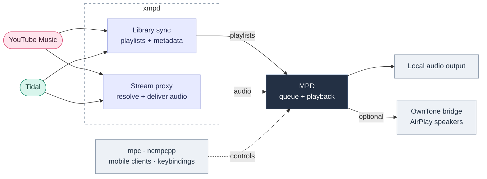

<h1 align="center">
  <picture>
    <source media="(prefers-color-scheme: dark)" srcset="docs/assets/xmpd-logo-dark.png">
    
  </picture>
</h1>

<p align="center"><strong>Your streaming libraries, played through MPD.</strong></p>

xmpd brings YouTube Music and Tidal playlists into the music tools you already
use. Search from a terminal, queue tracks with `mpc` or `ncmpcpp`, keep listening
history across machines, and optionally send audio to AirPlay speakers.



- **One queue, multiple sources.** Sync playlists and favorites from either or
  both providers. A provider error is handled independently during sync.
- **Keyboard-driven discovery.** Search, play, queue, start radio, and toggle
  likes from an fzf interface.
- **Stable playlist URLs.** Resolve expiring audio links at playback time;
  YouTube and DASH audio stream through ffmpeg.
- **Listening history.** Browse streaming and local-file plays, revisit your
  most-played tracks, and optionally synchronize history across machines.
- **Audio visibility.** Inspect source quality and the output chain with
  `xmpctl flow`; show playback in i3blocks or waybar.

[Get started](#get-started) · [Commands](#everyday-use) ·
[History](#listening-history) · [Desktop integration](#desktop-integration) ·
[Development](#updating-and-development)

## Get started

### Requirements

| Component | Used for |
|---|---|
| Linux, Bash, Python 3.11+ | Daemon and command-line tools |
| MPD and `mpc` | Playback and queue control |
| `ffmpeg` and `ffprobe` | Streaming and audio quality inspection |
| `uv` | Python environment and dependencies; the installer can install it |
| `fzf` | Interactive search and history browsers |
| Firefox signed in to YouTube Music | YouTube authentication and stream-resolution cookies |
| Deno on the daemon's `PATH` | YouTube JavaScript challenges; see [yt-dlp's setup guide](https://github.com/yt-dlp/yt-dlp/wiki/EJS) |
| Tidal account with streaming access | Optional Tidal provider |

You need credentials only for the providers you enable. For Tidal-only use,
disable `yt.enabled`; Firefox and Deno are not needed for Tidal.

### Install

```bash
git clone --branch main https://github.com/tuncenator/xmpd.git
cd xmpd
./install.sh
```

The interactive installer creates the Python environment, installs dependencies,
offers YouTube authentication and a systemd user service, and offers symlinks in
`~/.local/bin` for the control, search, history, status, and doctor tools. Keep
that directory on your `PATH`. MPD, ffmpeg, fzf, and Deno are separate system
prerequisites.

```bash
./install.sh --check   # Inspect installation readiness without making changes
```

### Connect to MPD

Edit `~/.config/xmpd/config.yaml` so its paths match your MPD configuration:

```yaml
mpd_socket_path: ~/.config/mpd/socket
mpd_playlist_directory: ~/.config/mpd/playlists
mpd_music_directory: ~/Music
playlist_format: m3u
```

Start MPD with your usual service or session setup, then verify the connection:

```bash
mpc -h "$HOME/.config/mpd/socket" status
```

A TCP connection is also supported, for example `mpd_socket_path: "localhost:6600"`.
Configure `mpc` to use the same endpoint; it does not read xmpd's YAML. The
examples below assume your `mpc` connection is already configured.

When using the supplied systemd unit with M3U playlists, allow writes to the
MPD playlist directory. Create the directory, run `systemctl --user edit xmpd`,
and add this drop-in, adjusting the path if needed:

```ini
[Service]
ReadWritePaths=%h/.config/mpd/playlists
```

The unit already permits writes to xmpd's config directory and the music
directory selected during installation. Other custom database or playlist
locations need corresponding write access.

### Authenticate and start

For YouTube Music:

```bash
xmpctl auth yt           # Extract Firefox cookies
xmpctl auth yt --manual  # Alternative: paste browser request headers
```

For Tidal:

```bash
xmpctl auth tidal
```

The Tidal command prints an authorization URL and waits for you to approve it
in your browser. It copies the URL when `wl-copy` or `xclip` is available.
Enable the provider in your config after authenticating:

```yaml
tidal:
  enabled: true
```

Credentials are stored in `~/.config/xmpd/browser.json` for YouTube Music and
`~/.config/xmpd/tidal_session.json` for Tidal. Reauthenticate if a session becomes
invalid; credential lifetime depends on the provider and browser session.

If you installed the systemd user service:

```bash
systemctl --user enable --now xmpd
xmpctl sync
xmpctl status
mpc lsplaylists
mpc load "YT: Liked Songs"   # Or "TD: Favorites" when Tidal is enabled
mpc play
```

`sync` starts a background job; use `status` to check its progress before loading
a playlist. Without systemd, run `.venv/bin/python -m xmpd` in the foreground.

## Configuration

Settings live in `~/.config/xmpd/config.yaml`. Unspecified keys use defaults;
restart the daemon after editing the file. The [example configuration](examples/config.yaml)
shows the main provider and playback settings.

| Setting | Default | Purpose |
|---|---|---|
| `yt.enabled` | `true` | Enable YouTube Music |
| `tidal.enabled` | `false` | Enable Tidal |
| `playlist_prefix` | `yt: "YT: "`, `tidal: "TD: "` | Distinguish provider playlists |
| `sync_interval_minutes` | `30` | Automatic sync interval |
| `enable_auto_sync` | `true` | Enable periodic sync |
| `playlist_format` | `m3u` | Use `m3u` or `xspf` |
| `yt.stream_cache_hours` | `5` | YouTube URL refresh age |
| `tidal.stream_cache_hours` | `1` | Tidal URL refresh age |
| `proxy_port` | `8080` | Local audio proxy port |
| `radio_playlist_limit` | `25` | Radio length, from 10 to 50 tracks |
| `like_indicator.enabled` | `false` | Add a like marker to playlist titles |
| `history_reporting.enabled` | `false` | Track qualifying plays and report streaming plays to their provider |
| `history.enabled` | `false` | Store local listening history and initialize history sync |

M3U files go in `mpd_playlist_directory`. XSPF files go under
`mpd_music_directory/_xmpd` and carry separate artist, title, and duration fields.
For XSPF, load a path such as `mpc load "_xmpd/YT: Liked Songs.xspf"`.

To refresh YouTube credentials automatically:

```yaml
yt:
  enabled: true
  auto_auth:
    enabled: true
    browser: firefox        # firefox or firefox-dev
    profile: null           # Auto-detect the profile
    container: null         # Optional Firefox container name
    refresh_interval_hours: 12
```

The daemon refreshes browser credentials at startup, periodically, and after an
authentication failure before sync. YouTube stream resolution also uses Firefox
cookies through yt-dlp, which can fetch its EJS challenge solver on demand.

## Everyday use

| Command | Action |
|---|---|
| `xmpctl sync` | Sync libraries into MPD |
| `xmpctl status` | Show daemon sync state and statistics |
| `xmpctl list-playlists` | List provider playlists |
| `xmpd-search` | Open interactive search across enabled providers |
| `xmpctl play tidal 12345678` | Replace the queue and play a track by ID |
| `xmpctl queue yt dQw4w9WgXcQ` | Add a track to the queue |
| `xmpctl radio --apply` | Generate and play radio from the current streaming track |
| `xmpctl like` / `xmpctl dislike` | Toggle the current streaming track's rating |
| `xmpctl like-toggle tidal 12345678` | Toggle a specific track's like |
| `xmpd-history` | Browse listening history |
| `xmpctl flow` | Inspect the current audio chain |
| `xmpctl help` | Show CLI options |

Use `mpc play`, `mpc toggle`, `mpc next`, `mpc prev`, and `mpc stop` for ordinary
playback. Ratings and radio stay with the track's source provider; they are not
mirrored between services.

### Search and selection

Run `xmpd-search`, type a query, then press **Enter** to switch from live search
to local fuzzy filtering of the results. Press **Esc** to return to search, or
again to close it.

These actions work in search's browse mode and in the history browser:

| Key | Action |
|---|---|
| **Enter** | Play the highlighted track and close |
| **Ctrl+E** | Queue the highlighted track and stay open |
| **Ctrl+R** | Start radio from the highlighted streaming track and close |
| **Ctrl+L** | Toggle a streaming track's like and stay open |
| **Tab** / **Shift+Tab** | Toggle selection and move down / up |
| **Ctrl+A** | Queue selected tracks and close |
| **Ctrl+P** | Replace the queue with selected tracks and start playback |

Search results show provider, catalog quality, and likes from the synced local
favorites playlists. With like indicators enabled, `like-toggle` patches title
markers in existing playlists and the live MPD queue. Favorites membership is
updated by sync; Ctrl+L keeps the current browse results in place.

For scripts or provider-specific searches, use the CLI:

```bash
xmpctl search-json --provider tidal --limit 10 "Miles Davis"
xmpctl search-json --provider yt --format fzf "Radiohead"
xmpctl radio --provider tidal --track-id 12345678 --apply
```

`search-json` emits one JSON object per track by default. The `--provider` flag
belongs to this command; the interactive `xmpd-search` wrapper searches all
enabled providers.

## Listening history

Enable both settings to record live plays in the local history database:

```yaml
history_reporting:
  enabled: true
  min_play_seconds: 30
history:
  enabled: true
```

A play is finalized when the track changes or playback stops. It qualifies after
30 seconds of actual playback by default, excluding pauses. Streaming plays are
reported to their source provider; local MPD files enter xmpd's history without
provider reporting.

`xmpd-history` opens the last 30 days of stored history. Type to filter, or press
**Ctrl+T** to switch between chronological plays and play counts. Local files
support play and queue actions; likes and radio apply to streaming tracks.

```bash
xmpctl history-json --mode count --since 7d --format json
xmpctl history-backfill --log "$HOME/.config/mpd/mpd.log" --dry-run
xmpctl history-backfill --log "$HOME/.config/mpd/mpd.log"
```

Backfill imports MPD log entries, skips already imported plays, and filters
failed-decode entries. The log path must match your MPD setup.

History sync exchanges records with an aggregator over SSH after a Tailscale
reachability check. Records are stored locally first, so browsing does not wait
for the network. Enabling history also starts sync attempts; the
`history.watchtower.enabled` key is currently not consulted by the daemon.
Without a reachable aggregator, local records remain available.


See [History setup](docs/HISTORY.md) for the receiver, restricted SSH key,
configuration, and `xmpd-doctor` diagnostics.

## Audio quality and delivery

| Source | Delivery to MPD |
|---|---|
| YouTube | ffmpeg streams FLAC over localhost with HTTP reconnect options |
| Tidal DASH | ffprobe selects the highest-bitrate audio stream; ffmpeg delivers FLAC |
| Other direct provider URLs | HTTP 307 redirect to the upstream audio URL |
| Local files | MPD reads its own music library |

FLAC transport does not turn a lossy source into lossless audio. Search badges
reflect catalog metadata; source probes and the actual output configuration
provide a more useful picture of what reaches your speakers:

```bash
xmpctl flow          # Source, MPD, and output details
xmpctl flow --brief  # One-sentence verdict
xmpctl flow --short  # Compact summary
```

**Tidal quality:** `quality_ceiling` is accepted in config, but the current
manifest request path does not enforce that value. It requests FLAC and
FLAC_HIRES variants and selects by reported bitrate, falling back to the first
audio stream if probing fails. A HiRes catalog badge alone does not establish
the quality being delivered; inspect `xmpctl flow` for the current track.

The proxy refreshes expired URLs on demand and exposes source information at
`/proxy/<provider>/<track_id>/info`. See [Stream Proxy](docs/STREAM_PROXY.md) for
routes, caching, retry behavior, and timeouts.

## Desktop integration

### i3blocks and waybar

`xmpd-status` uses its own MPD connection settings, defaulting to
`localhost:6601`. Set `--host` and `--port` to match your MPD instance; the
examples below use port **6600**.

For i3blocks:

```ini
[xmpd-status]
command=~/.local/bin/xmpd-status --host localhost --port 6600 --handle-clicks --show-position --max-length 75
interval=1
markup=none
```

For waybar:

```json
{
  "custom/xmpd": {
    "exec": "~/.local/bin/xmpd-status --watch --host localhost --port 6600 --show-quality",
    "return-type": "json",
    "format": "{}"
  }
}
```

The waybar mode listens for MPD idle events and reconnects after MPD restarts.
The status display adapts to available width and can show playlist position,
progress, and source quality. Use `--music-dir` when your local library is not
under `~/Music`. More options: `xmpd-status --help` and
[i3blocks integration](docs/i3blocks-integration.md).

### AirPlay

The optional [AirPlay bridge](extras/airplay-bridge/) connects MPD through
PipeWire and OwnTone to your receivers. Its installer targets Arch/Manjaro and
uses `yay` for packages that need it.

```bash
./extras/airplay-bridge/install.sh --check
./extras/airplay-bridge/install.sh
speaker list
speaker multi 12345678        # Replace with an ID from speaker list
speaker laptop               # Return to local output
speaker status
```

The bridge forwards metadata and artwork. Its watchdog can restore a dropped
route while MPD is playing, and volume keys can follow the route or be pinned
with `vol-wrap target local`, `vol-wrap target airplay`, or `vol-wrap target auto`.
Per-machine settings live in `~/.config/mpd-owntone-bridge/config.env`.

## Troubleshooting

| Symptom | Check |
|---|---|
| Daemon will not start | `journalctl --user -u xmpd -n 80 --no-pager`; verify the MPD endpoint and writable paths |
| No synced playlists | `xmpctl status`; check provider auth and playlist format; allow the background sync to finish |
| YouTube auth or bot errors | Sign in through Firefox, run `xmpctl auth yt`, and check that Deno is on the service's `PATH` |
| Tidal authentication fails | Run `xmpctl auth tidal`, then restart xmpd |
| A track fails to start | Check ffmpeg/ffprobe availability and `~/.config/xmpd/xmpd.log`; URL refresh happens at playback time |
| Playback is silent | Check `mpc outputs` and `speaker status` if using AirPlay |
| Status widget is empty | Run it in a terminal with explicit `--host` and `--port` |
| History stays empty | Enable both history settings, restart, and play a track past the threshold before stopping or skipping |

## Updating and development

To update an installed checkout, pull changes, rerun the installer to refresh
dependencies and tool symlinks, and restart the service:

```bash
git pull --ff-only
./install.sh
systemctl --user restart xmpd
```

For development, use the locked environment. Tests need Linux, Bash, `sqlite3`,
`jq`, and permission to open local sockets. Provider APIs are mocked; live Tidal
tests are opt-in through `XMPD_TIDAL_TEST=1` and excluded from CI.

```bash
uv sync --locked --extra dev
uv run --locked --extra dev bash scripts/check.sh
```

The check script runs Ruff, mypy, version consistency, and pytest. GitHub Actions
runs the same checks on Python 3.11 and 3.13. Individual checks:

```bash
uv run --locked --extra dev ruff check xmpd/
uv run --locked --extra dev mypy xmpd/
uv run --locked --extra dev pytest -q
uv run --locked --extra dev pytest --cov=xmpd --cov-report=term-missing
```

| Code | Responsibility |
|---|---|
| [`xmpd/daemon.py`](xmpd/daemon.py) | Lifecycle, shared state, socket dispatch |
| [`xmpd/commands/`](xmpd/commands/) | Playback, ratings, search, and history commands |
| [`xmpd/providers/`](xmpd/providers/) | YouTube Music and Tidal adapters |
| [`xmpd/sync_engine.py`](xmpd/sync_engine.py) | Library and playlist synchronization |
| [`xmpd/stream_proxy.py`](xmpd/stream_proxy.py), [`stream_transport.py`](xmpd/stream_transport.py) | URL resolution, HTTP delivery, ffmpeg, and probes |
| [`xmpd/history_store.py`](xmpd/history_store.py), [`history_syncer.py`](xmpd/history_syncer.py) | Local history and cross-machine exchange |
| [`bin/`](bin/) | CLI tools and desktop integration |

For existing ytmpd installations, see the [migration guide](docs/MIGRATION.md).

## License and credits

[MIT](LICENSE). Built with [MPD](https://www.musicpd.org/),
[ytmusicapi](https://github.com/sigma67/ytmusicapi),
[python-tidal](https://github.com/tamland/python-tidal),
[yt-dlp](https://github.com/yt-dlp/yt-dlp),
[python-mpd2](https://github.com/Mic92/python-mpd2), and
[OwnTone](https://owntone.github.io/owntone-server/).
